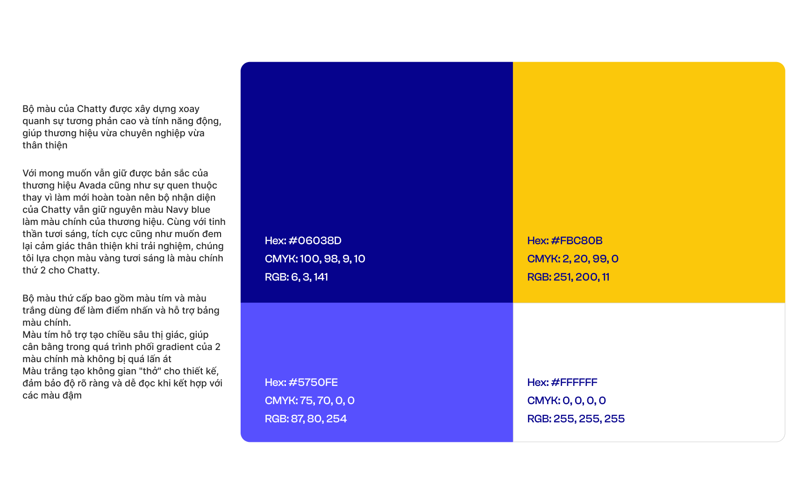
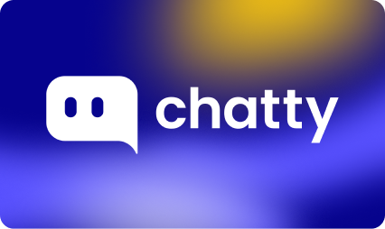
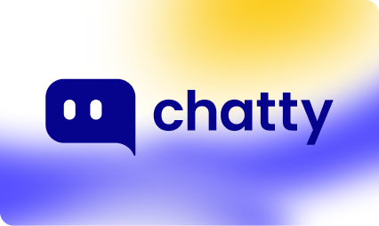
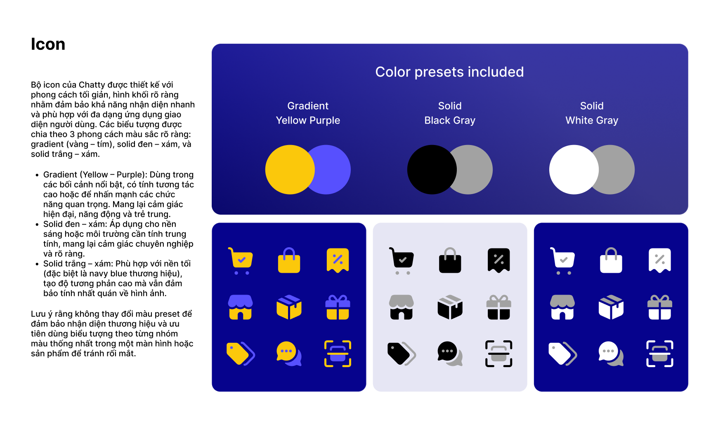
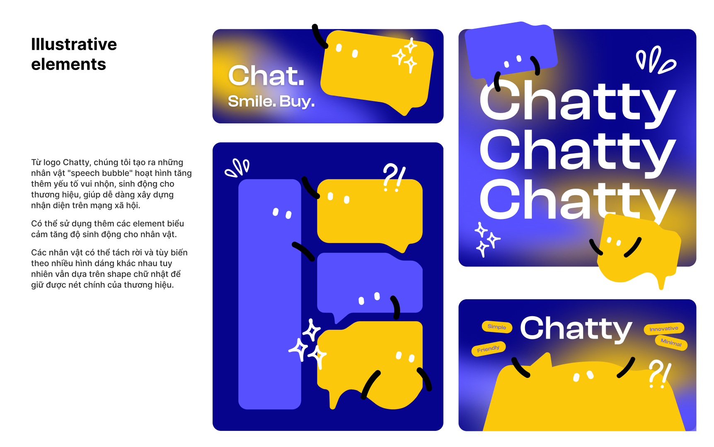
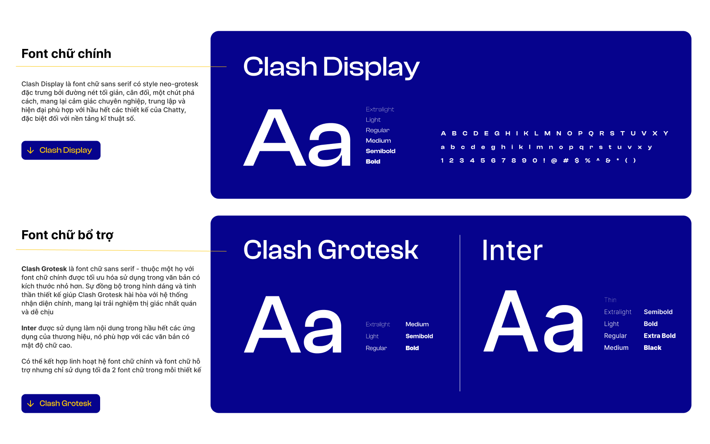
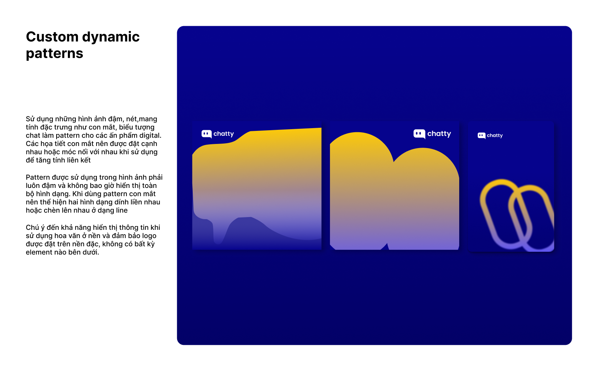
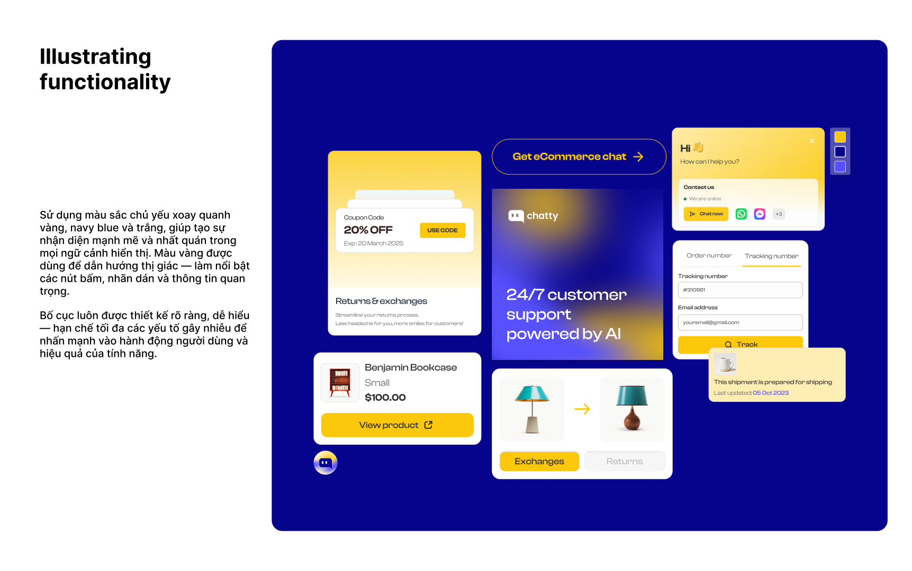
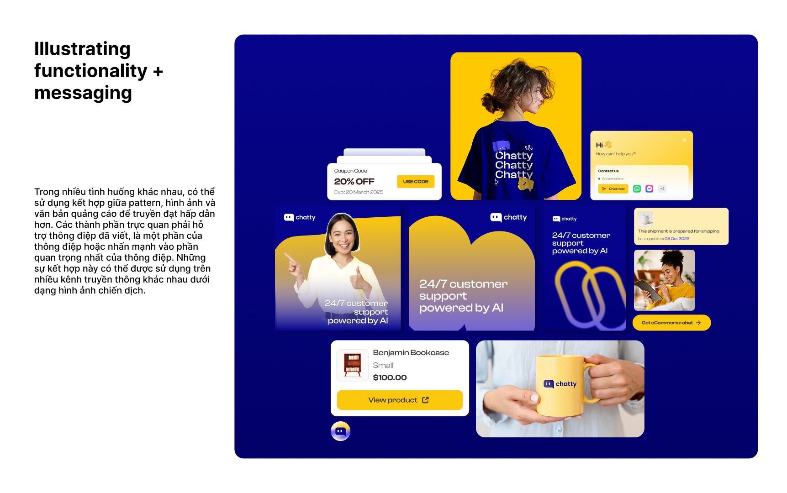

# Chatty Brand Guidelines

Source: https://www.figma.com/design/PTYSX83T1FZuHFG0Jqsgah/Chatty-branding-2025?node-id=57-2912&p=f&t=YwSzs0hODfzgypPO-0

## Positioning

"The AI-first chat platform built for eCommerce sales"

- Emphasize a clean, user-friendly experience
- Emphasize innovation and creativity

---

## Brand Voice

| English | Vietnamese |
|---------|-----------|
| Clear | Ro rang |
| Modern | Hien dai |
| Friendly | Than thien |
| Approachable | De gan |
| Simple | Don gian |
| Trustworthy | Dang tin cay |

---

## Colors

Built around high contrast and dynamic energy — professional yet friendly.

**Primary colors:**

| Color | Hex | RGB | CMYK | Usage |
|-------|-----|-----|------|-------|
| Navy Blue | #06038D | 6, 3, 141 | 100, 98, 9, 10 | Main brand color, inherited from Avada identity |
| Bright Yellow | #FBC80B | 251, 200, 11 | 2, 20, 99, 0 | Secondary primary, adds brightness and positivity |

**Supporting colors:**

| Color | Hex | RGB | CMYK | Usage |
|-------|-----|-----|------|-------|
| Purple | #5750FE | 87, 80, 254 | 75, 70, 0, 0 | Adds depth, balances gradients between blue and yellow |
| White | #FFFFFF | 255, 255, 255 | 0, 0, 0, 0 | Breathing room, readability with dark colors |

---

## Logo

The logo is a speech bubble with two rounded "eyes" — the Chatty face. Available in two forms:

- **Icon** — speech bubble only (for app icons, favicons, small spaces)
- **Full logo** — speech bubble + "chatty" wordmark

### Logo Files

**Icons:**

| Preview | File | Description |
|---------|------|-------------|
|  | icon-blue-white-bg.png | Dark blue bubble on white background |
|  | icon-white-blue-bg.png | White bubble on solid blue background |
|  | icon-dark-gradient-bg.png | Dark blue bubble on yellow/blue gradient background |
|  | icon-white-gradient-bg.png | White bubble on dark gradient background |

**Full logos:**

| Preview | File | Description |
|---------|------|-------------|
|  | logo-blue-white-bg.png | Dark blue logo on white background |
|  | logo-black-white-bg.png | Black logo on white background |
|  | logo-white-blue-bg.png | White logo on solid blue background |
|  | logo-white-dark-gradient-bg.png | White logo on dark gradient background |
|  | logo-blue-light-gradient-bg.png | Dark blue logo on light gradient background |

---

## Icon Color Presets

Three presets for different contexts:

| Preset | When to use |
|--------|-------------|
| **Gradient (Yellow-Purple)** | Highlights, strong emphasis, dynamic and energetic feel |
| **Solid Dark (Black/Gray)** | Professional or formal contexts |
| **Solid White (White/Gray)** | Dark backgrounds, maintaining brand recognition |

---

## Illustrative Elements

- The **speech bubble** from the logo is the core visual element — use it across social media, marketing, and product
- Tagline: **"Chat. Smile. Buy."**
- Speech bubbles come in various shapes and sizes to add liveliness
- All elements should feel dynamic while staying consistent with the brand

---

## Typography

**Primary font — [Clash Display](https://www.fontshare.com/fonts/clash-display)**

Sans serif, neo-grotesk style. Clean, balanced, slightly edgy — professional yet modern. Used across most Chatty designs, especially digital platforms.

| Weight |
|--------|
| Extralight |
| Light |
| Regular |
| Medium |
| Semibold |
| Bold |

**Supporting fonts — [Clash Grotesk](https://www.fontshare.com/fonts/clash-grotesk) & Inter**

- **Clash Grotesk** — same family as Clash Display, optimized for smaller text. Maintains visual consistency with the primary font
- **Inter** — used for body content across brand applications. High legibility at all sizes

Rule: use max **2 fonts** per design (primary + one supporting).
License: Fontshare Free Font License — 100% free for personal and commercial use.

---

## Custom Dynamic Patterns

- Use dynamic images and illustrations featuring the **eye icon** and **speech bubble**
- Patterns are used subtly in digital products — never show the full shape
- When using the eye pattern, keep it **abstract and blurred**
- The **logo must always be placed on top** — never obscured by pattern elements

---

## Illustrating Functionality

- Use primarily **yellow, navy blue, and white** to create visual importance and hierarchy
- Yellow draws attention; blue and white provide structure
- Layout should be **clean and clear** — limit elements to emphasize usability and feature effectiveness
- Use to showcase product features like chat widgets, AI support, product cards, etc.

---

## Illustrating Functionality + Messaging

- Combine **banners, images, and ad copy** with functionality illustrations for richer storytelling
- Visual components (illustrations) should be the focal point of the message
- Can be used as **campaign visuals, social ads, or marketing banners**
- Mix photography with product UI elements for a dynamic, approachable feel
