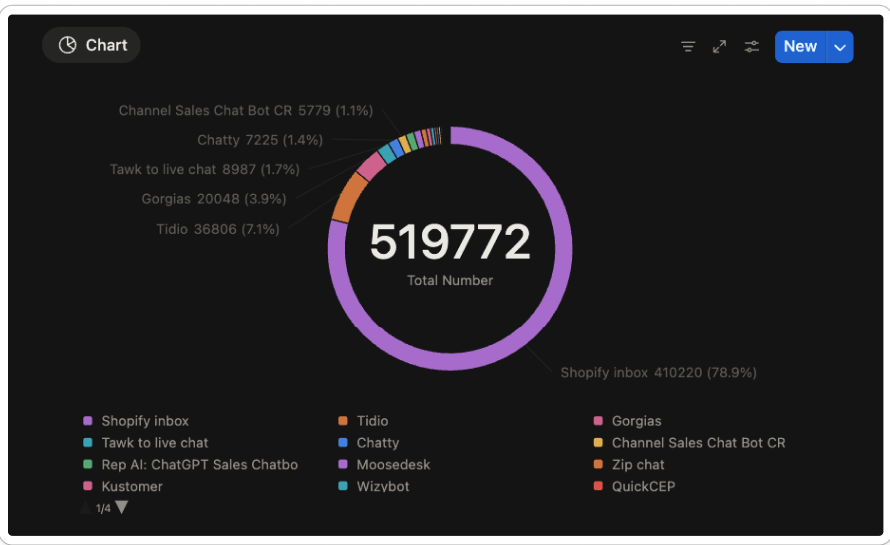

# Chatty product strategy 2026

Type: Brainstorm

# Context

## Where we are:

- 21k active user, 1.3k paid
- Shopify only:
    
    + 78.9% khách hàng dùng Shopify inbox
    
    + 7.1% Tidio, 3.9% Gorgias
    
    + 1.4% khách dùng Chatty
    
    
    
- Product market fit:

| Segment | PMF Strength | Evidence |
| --- | --- | --- |
| Micro ($300k -$500k ARR) | Develop | Price, Feature |
| Small ($500k -$800k ARR) | Develop | Price, Feature |
| Medium-Mid ($800k-5M) | Nascent | Feature, usage |
| Enterprise | Nascent | Integration, use cases |
|  |  |  |

<aside>
👀

Chatty với 21k merchant chiếm 1.4% Shopify merchant đang rất nhỏ trên thị trường
Đối với Livechat - đây là một thị trường đỏ cho Chatty, không có cửa cạnh tranh

Đối với AI - là một thị trường tiềm năng, các đối thủ cũng đang xoay nguồn lực sang adopt AI

</aside>

## **Competitive position:**

| Direct | Tidio, Vanchat | Same customer, same problem, broader scope, high branding |
| --- | --- | --- |
| Adjacent - indirect | Gorgias, intercom, Shopify inbox | Same customer, broader scope, high branding |
| Emerging - potential | Manifest, Flyweight, Moosedesk,… | AI-native startups, niche solution |

Quick comparision:

|  | Gorgias | Tidio | Chatty |
| --- | --- | --- | --- |
| Focus | Support-first | Support + basic sales | Sales-first |
| Target | Mid - enterprise | SMB | SMB |
| Pricing | $$$ | $$ | $ |
| AI depth | Add-on | Basic | Advance |

|  | Chatty | Tidio |
| --- | --- | --- |
| Where we win | Giá rẻ, kịch bản cho eCommerce. | Branding mạnh
Workflow setup sẵn, dễ dùng, dễ customize
All in one solution
Tập trung vào upmarket Mid → Enterprise |
| Where we lose | Phân bổ nguồn lực làm All in one solution | Giá cao
Đi chung chung, chỉ làm tính năng
Không đi sâu vào eCommerce |
| Primary threat | Explaining value difference | Tidio đang push Lyro AI mạnh hơn - nếu họ thêm sales features, gap sẽ thu hẹp

https://updates.tidio.com/en |
| Biggest opportunity | - Đi sâu vào kịch bản ngành hàng, chất lượng trả lời
- Mở rộng ability của AI
- Kết hợp chuyên sâu giữa AI với người
- Personalize trải nghiệm khách mua hàng |  |

Product positioning đối với khách hàng:

- AI sophistication: Chất lượng của AI
- Sale focus: tập trung vào giai đoạn nào của bán hàng

<aside>
👀

Các khu vực cạnh tranh:

 1. Đối thủ đang quyết vấn đề gì? 

Vấn đề trải nghiệm khách hàng nhằm tăng tỉ lệ khách hàng quay lại mua
- Đa số các đối thủ cạnh tranh đang tập trung vào Customer support - after sale service nhằm tăng trải nghiệm khách hàng. 

⇒ Chatty rất khó cạnh tranh nếu làm chuyên sâu về Customer support

 2.  Đối thủ đang phục vụ khách hàng nào?

Nhóm khách hàng tệp cao, tập trung vào dịch vụ khách hàng. Thường là những big corp với >20 nhân sự, có nhiều hệ thống cửa hàng và kho vận.

1. Đối thủ đang đứng đâu trên thị trường

Đang là top of mind, được nhiều khách hàng sử dụng. 

</aside>

## **Customer statement:**

Insights: https://capture.avada.io/i/bG5lsFUXOMjT

Customer 

Customer pain point

Chân dung khách hàng https://www.figma.com/board/wY03PydcWdqxzkmTyuU4aY/Chatty-product-strategy-2026?node-id=10-403&t=an0mQs2lfO9Hbcja-4

## Ideal Customer Profile:

> **Narrowed ICP (Feb 2026):** Growing DTC brand on Shopify ($700K-$2M) that's spending on ads, losing sales to unanswered questions, and needs an AI that answers product questions 24/7 while working alongside their small CS team.
>
> **Principle:** ICP = who converts EASIEST — understands benefit immediately, has clear daily pain, converts without much effort. Not "everyone we could sell to."
>
> See full definition: `weare/plan-2026/icp-segmentation.md`

### **WHO they are:**

DTC brand selling online on Shopify, có thể bán hàng đa kênh trên Facebook, instagram, whatsapp.

Đang **scale traffic nhưng stuck tại convert và support** — đầu tư vào ads nhưng khách rời đi vì không được trả lời nhanh.

### **Growth stage:**

Growing: đã qua giai đoạn sống sót 1-2 năm đầu, có lượng order đều, đang đầu tư vào growth channels (ads, email, influencer).

### **Hành vi:**

Họ bắt đầu chú trọng vào thử nghiệm kênh tối ưu doanh thu, dành nhiều nguồn lực hơn để growth.

Scale traffic nhưng stuck tại convert và support — đây là DẤU HIỆU quan trọng nhất để nhận diện ICP.

Operation inquiries (thắc mắc về khâu vận hành): làm thế nào để ứng dụng sản phẩm vào workflow hiện tại.

### **Firmographics**

| Ngành hàng | Sản phẩm cần tư vấn trước khi mua (sizing, compatibility, ingredients, dimensions, materials) — khách hàng HỎI trước khi MUA |
| --- | --- |
| Monthly revenue | **$58K - $167K** (tương đương $700K-$2M/năm) |
| Role | Store owner, eCommerce Manager |
| Yearly revenue | **$700K - $2M** ← ICP core range. Adjacent: $300K-$700K (volume), $2M-$5M (upsell) |
| Team | 2-8 member. Gồm support, fulfillment, marketing. **1-3 CS, chỉ trực business hours** |
| Location | US, Canada, UK, Úc, EU |
| Traffic lead | Ads (FB, IG, Google) — spending $3K+/mo. **Scale traffic nhưng stuck tại convert và support** ← đây là pain signal quan trọng nhất |
| Ready to pay | $50 - $200/tháng (Pro plan). Sẽ trả $200-$500 nếu ROI clear |
| Tool experience | **Đã dùng Shopify Inbox hoặc chatbot cơ bản — không hài lòng, đang tìm giải pháp tốt hơn.** Đây là dấu hiệu ICP: họ hiểu category, không cần educate "chatbot là gì" |
| Tech savvy | Trung bình. Biết về công cụ, từng dùng chatbot, biết về flow design. nhưng không chuyên sâu về AI. AI setup mới lạ đối với họ, nhu cầu muốn đảm bảo chất lượng, khả năng kiểm soát tốt |
| Tech stack | Số lượng app gọn gàng (5-10 app), thời gian cài app cố định, họ sẽ cài 1 nhóm app vào 1 thời điểm cụ thể như đầu năm hoặc trước mùa sale
Có budget, PnL rõ ràng cho các app (1-3%), scale tới 5% cho app nếu mang lại ROI tốt

Nhìn vào  xu hướng cài app chúng ta có thể phân bổ đối tượng từ mới tìm cách growth đến growth mature rồi nhưng vẫn đang tìm cơ hội optimize

Tech stack điển hình sẽ đi theo thời gian, ban đầu là các app phễu, và gần đây họ triển khai sử dụng các mang tính chiến lược, liên kết. Bao gồm những app thuộc tier mid hoặc high, có integration trực tiếp với nhau 

Ví dụ:
  • Survive bắt đầu growth : [https://capture.avada.io/i/fNdY7kn1041W](https://capture.avada.io/i/fNdY7kn1041W)
  • Đang growth: [VD1](https://capture.avada.io/i/wd683HR9j7fa), [VD2](https://capture.avada.io/i/wVPFlY5gB3SF), [VD3](https://capture.avada.io/i/0fynolbgZC7k)
  • Mature growth: [VD1](https://capture.avada.io/i/J8lVyxi9iFmp) - Những tệp lớn thường có xu hướng tinh gọn techstack, chỉ dùng nhưng app thực sự giải quyết vấn đề

Stack theo objective thường thấy:
1. Collect Lead:
  • Email marketing: Klaviyo, Yotpo
  • Affiliate marketing
2. Conversion:
  • Review: Judge.me, Yotpo
  • Upsell & bundle
3. Customer support: 
  • Order tracking: 17Track
4. Loyalty
5. Policy, consent
  • Anti theft, anti spy
6. Tracking, optimization, A/B testing
7. Payment provider: Klarna |

### **Vấn đề đang gặp phải**

| Pain point | Hệ quả | Priority |
| --- | --- | --- |
| Khách rời đi vì trả lời chậm | Trả tiền nhiều vào traffic nhưng conversion thấp | Critical |
| Không đủ nguồn lực CS | CS team không handle hết conversation
Chất lượng không ổn định
Chỉ support on demand
Tốn thời gian trả lời tin nhắn lặp đi lặp lại | Critical |
|  |  |  |
| Cart abandonment nightmare | 70% of Abandoned cart | Major |
| Không thể reach out khách hàng tiềm năng |  | Major |
| Lo lắng trả lời không đúng voice của brand | Các brand DTC rất quan tâm đến tone of voice, cách nói chuyện.
Họ sợ AI cứng nhắc, làm mất sự gần gũi, ảnh hưởng tới thương hiệu
⇒ Họ muốn AI **thông minh nhưng "người"**, phản hồi tự nhiên, học từ chính CS team của họ | Moderate  |
| Tool hiện dùng không giải quyết được vấn đề | Giá đắt, sử dụng AI là 1 add-ons, phải charge thêm nhiều
 Workflow không đủ linh hoạt
⇒ Cần AI trả lời tốt, dễ áp dụng vào quy trình hiện tại | Moderate  |

### **Jobs to be done - MC cần đạt được gì**

| Mục tiêu | Description |
| --- | --- |
| Tăng tỷ lệ chuyển đổi trước mua | Loại bỏ friction của customer khi mua
Trả lời, giới thiệu thông tin sản phẩm đúng với nhu cầu khách hàng

Hướng dẫn khách mua hàng |
| Giảm chi phí và chất lượng CS khi scale | Giảm câu trả lời lặp đi lặp lại
Cần trả lời nhanh, 24/7, ghi nhớ tốt kiến thức |
| Phân loại khách hàng | Ưu tiên khách hàng tiềm năng → đẩy về người thật khi available |

### **Desired outcome - What makes them buy**

Must have

| Revenue attribution | Rõ ràng value mang lại bởi AI |
| --- | --- |
| Easy setup | Dễ hiểu, nhanh chóng thấy kết quả |
| Reliable & accurate | 1. không đưa sai sản phẩm
2. tự nhiên
3. Kiểm soát tốt khi nào handle tới human |
| Quản lý kịch bản AI | Kịch bản giải quyết đúng business problem
Dễ kiểm soát, trả lời theo store tone & voice |

High value gain

| Giảm CS workload hiệu quả | Show thông qua report, giảm nguồn lực về người và effort phải bỏ ra |
| --- | --- |
| Proactive engage | 1. Thu hút hành vi mua hàng
2. Khách có thể thấy customers profile để chủ động reach out khách vip đang online
3. Recover ACE |
| Cung cấp Insights | 1. Most asked questions
2. How AI perform
3. What customer need? |
| Đáp ứng working process | 1. Dễ dàng kết nối với workflow hiện tại
2. Integration với tool hiện có, tăng hiệu quả
3. Đấu nối với CRM sẵn có |
| Khả năng scale | Scale được nhiều store, full time |
| Multi channel | Với khách dùng đa kênh bán hàng, kết nối social channel và có function support là cần thiết |

Nice to have

- Multilingual support
- Customizable design to match brand
- Advanced analytics and reporting

### Evaluation criteria (trong 7-14 ngày khi cài)

| Accuracy & Quality (40%) | Does it actually work? Will this break?  |
| --- | --- |
| Revenue impact (15%) | Will this make us money or just save time? |
| Ease of Use (15%) | Can I set it up myself in < 1 day? |
| Price vs. Value (10%) | Is ROI clear? Fair pricing model? |
| Workflow (10%) | Does it easy to implement to our workflow, tech stack |

### Tóm tắt insights:

- **Revenue attribution is THE killer feature** ⇒ Bắt buộc phải chứng minh được ROI mang lại sớm nhất có thể
- **Pre-sale > Post-sale priority** - Họ đau đầu về lost revenue hơn là support efficiency
- **Setup phải < 4 hours** - Nếu phức tạp hơn, churn rate cao
- **Price sensitivity, thuyết phục bằng value-driven** - Họ sẽ trả $299-499/mo nếu ROI clear, nhưng $99 với unclear value thì không
- **Trust is everything** - Một lần AI answer sai ⇒ immediately turn off và churn
- **Proactive > Reactive** - Feature engage visitors proactively (not wait for them to ask) = major differentiator
- **Mobile is critical** - 60-70% traffic từ mobile, AI phải fit với mobile, không ảnh hưởng tới trải nghiệm mua hàng

### Cách phân loại & khai thác insights khách hàng ICP

1. Dựa trên data

Đa phần có thể dựa vào data trên Storeleads để đánh giá khách hàng, ví dụ:

Tệp mid - ICP

Tệp enterprise

|  | Fit (3đ) | Normal (1đ) | Not fit (0đ) |
| --- | --- | --- | --- |
| Estimate sale (year) | **$700K-$2M** (ICP core) | $300K-$700K hoặc $2M-$5M | <$300K hoặc >$5M |
| Shopify plan | Basic trở lên, revenue fit | Basic (size nhỏ) | Dev store |
| Country | US, UK, Canada, AU, EU | SG, other markets | China, India |
| CS coverage gap | **1-3 CS, chỉ business hours** | Owner tự handle CS | Không cần CS hoặc >10 CS |
| Traffic investment | **Đang chạy ads, stuck ở conversion** | Organic only | Không có traffic |
| Tool experience | **Đã dùng chatbot, không hài lòng** | Chưa dùng bao giờ | Hài lòng với tool hiện tại |
1. Câu hỏi dùng để đào insight và criteria tham chiếu

Với team CS/ TS: 

Những thông tin này CS cần hỏi và đánh giá theo thang điểm, khuyến khích vừa support vừa hỏi để define ra tệp khách
KPI của support nên là: 

Số lượng khách hàng xác định là ICP được hỗ trợ thành công

Hỗ trợ thành công có thể đánh giá bằng resolved status, good review, thanks messages at the end of conversation

|  |  | Fit (3đ) | Normal (1đ) | Not fit (0đ) |
| --- | --- | --- | --- | --- |
| Team operation | Hiện bạn đang có người trực chat không?
Có fulltime không? | Có từ 2 người trở lên
Chỉ trả lời trong working hour | Không có người trực

>10 người trực |  |
|  |  |  |  |  |
| Pain points |  |  |  |  |
| Kinh nghiệm dùng tool |   1. Bạn đã dùng support tool nào trước đó chưa?
  2. Nếu có bạn hãy nếu một số điểm thích và pain point khiến bạn quan tâm đến chúng tôi | Đã dùng tool support, livechat trước đó | Chưa dùng bao giờ | Mới kinh doanh, chưa dùng bao giờ |
|  |  |  |  |  |
| Nhu cầu dùng AI vào workflow hiện tại |  | AI work cùng team |  | AI trả lời 100% |
| Mong muốn tính năng, outcome |  | Tối ưu doanh thu
Nói rõ nhu cầu và luồng quan tâm:
  • Trả lời sản phẩm
  • Handover tới người thế nào
  • các kịch bản hỏi thực tế | Trả lời câu hỏi lặp lại | Không rõ ràng, chỉ trả lời chung chung,
muốn AI reply mà không có người trả lời

Hỏi những kịch bản không thực tế |
| Kênh |  |  |  |  |
| Mục đích business của khách hàng | Bạn cài sản phẩm nhằm giải quyết vấn đề gì?

Với những dev store hoặc có password, cần hỏi mục đích làm gì | Test cho store thật

Agency giới thiệu chatty

Tìm cơ hội integrate |  | Chuẩn bị mở store

Spy, thường là email của công ty cùng ngành. Đặc điểm là hỏi nhiều về tính năng chính ⇒ Block đồng thời thông báo PM

 |
1. Dựa trên nhu cầu khách chủ động đề cập

### Target customer strategy Chatty 2026

<aside>
👀

**Primary ICP:** Growing DTC brands ($700K-$2M ARR) đang scale traffic nhưng mất sales vì không trả lời kịp — 65% revenue target

**Adjacent segments:**
- Emerging ($300K-$700K): Volume play, viral loop, future ICP pipeline — 15% revenue
- Scaling ($2M-$5M): Upsell từ ICP customers khi họ grow — 10% revenue

**Nguyên tắc:** Focus vào ICP trước. Emerging tự serve. Scaling chỉ upsell, không cold-acquire.

Mục tiêu doanh thu: Scale to $1M ARR

Measure by:

- 65% from Pro tier (ICP)
- 10% from Plus tier (Scaling upsell)
- 15% from Basic tier (Emerging volume)
</aside>

Chiến lược của Chatty focus vào việc cạnh tranh trực tiếp và win Tidio trong 8 năm

Tidio hiện tại:

- 12 năm phát triển sản phẩm
- Revenue 2023: $29.4 million → 2024: $48.4 million
- Employee 2024: 174 members

**Thể hiện qua doanh thu mục tiêu 5 năm:
$256K ARR → 10 million ARR in 2030**

# Strategy

<aside>
👀

Mục tiêu tới năm 2028:

Establish Chatty as the leading AI sales assistant for mid-market Shopify merchants ($800K-$5M ARR)

Mục tiêu năm 2026:

AI assistant chuyên sâu cho một số ngành lớn (Apparel - fashion, cosmetic, furniture,..). Phục vụ usecase và nhu cầu customization của mid-market

Tạo ra unique value của sản phẩm bằng cách:

- Đi sâu vào kịch bản ngành hàng, chất lượng trả lời
- Mở rộng ability của AI gồm condition và action cụ thể
- Kết hợp chuyên sâu giữa AI với người
- Personalize trải nghiệm khách mua hàng
- Kết nối đa kênh
</aside>

Team dự kiến sẽ dành 30% effort vào Growth và 70% effort vào Product development, trong đó:

- Growth: tối ưu các chỉ số kinh doanh, nhằm tạo doanh thu tốt hơn
- Product: Discover, Improve, release tính năng nhằm tăng giá trị về mặt sử dụng của app

## Growth strategy:

Chia làm strategic pillar theo độ ưu tiên

<aside>
💡

Revenue = ARPU * Active subs

Trong đó ARPU = price theo plan + usage charge

</aside>

### Growth pillar #1: Tăng ARPU & LTV:

> ARPU hiện tại: $23, LTV: $100 ⇒ Target ARPU: $30, LTV: $228
> 

<aside>
👀

Kiếm nhiều tiền hơn từ merchant PIC, tệp cao, Chatty là must have với họ.

</aside>

**WHY:** Chatty hiện đang đứng top 1 trên hầu hết các category, giá để acquire một user mới cao hơn rất nhiều so với việc khách hàng mua thêm usage

⇒ Tối ưu giá trị từ 1 active user hơn là acquire user mới

**WHAT:** Target đối tượng khách hàng tier cao hơn. Target từ Small → Medium → Mid merchant

**HOW TO:**

- Có những feature cung cấp value trực tiếp tới khách hàng, bán nhiều hơn cho 1 merchant, thêm dựa vào:
    - Usage-based pricing → outcome-based pricing
    - Add-ons
- Tập trung phục vụ khách hàng PIC:
    - Target tệp khách hàng mục tiêu, đẩy mạnh bản Pro, Plus
    - Giữ chân khách hàng PIC paid ít nhất 12 tháng
- Định vị solution cho mid merchant:

### Growth pillar #2: Giảm churn, Tăng conversion, :

Tối ưu phễu chuyển đổi và giữ chân khách hàng nhằm tăng doanh thu hiệu quả

1. Giảm churn rate: từ 11% → 8%
    
    **WHY**: Churn rate cao hơn 12% tương đương để mất > 79% khách hàng trả phí sau 12 tháng 
    
    
    
    **HOW TO:**
    
    - Tăng chất lượng tính năng AI, đi sâu vào ngành hàng
    - Clear về ROI mà AI mang lại cho merchant
    - Đảm bảo tính năng stable
    - Cung cấp dịch vụ support, train AI chuyên sâu với khách trả phí
2. Tối ưu conversion rate lên paid plan: từ 3.5% lên 9%
    
    **WHY**: Sẵn sàng mở phễu, khi install tăng, conversion tăng theo
    
    **HOW TO:**
    
    - Plug & play - Đảm bảo dễ dùng:
        - Onboarding tốt: cần liên tục A/B test và optimize onboarding và setup guide
        - Setup sẵn kịch bản phù hợp theo ngành hàng survey được từ khách
        - Cung cấp best practice để merchant train AI
    - Quick time to value:
        - Show các case của AI → khả năng xử lý của AI
        - Cho khách hàng thấy value về Revenue rõ ràng của sản phẩm
        - Show dự đoán revenue và cost AI mang lại sau khi cài 1-3 ngày
    - Pricing dễ hiểu, dễ kiểm soát charge
    - Segment conversion: chăm sóc khách hàng reach milestone setup

### Growth pillar #3: Scale, tăng install

**WHY:** Chatty hiện tại đạt #1, #2 ranking ở hầu hết các keyword trên Shopify, việc growth về install trên mỗi Shopify sẽ gặp khó khăn

**WHAT:**

- MKT
    - Thu hút install từ website
    - KOL, KOC
    - Agency, affiliate: các app đối thủ đều mạnh nguồn này
- Product:
    - Cross install từ các app phễu, partner
    - Standalone app: Cho phép khách hàng cài ở các Market platform khác (WooCommerce, Wix, Bigcommerce, Saleforce, Magento,…)
    - Referall: giới thiệu giữa các khách hàng với nhau
    - Integrate strategic partner

**HOW TO - Product**

Standalone app:

- Create account, connect shop, connect các nền tảng khác dễ dàng
- Cho phép đọc catalog, order, tích hợp API các nền tảng khác → AI trả lời sản phẩm, order là minimum.

Integrate strategic partner:

- Pick các partner lớn, depth integration. Một số partner có tạo app trên marketplace → cần tạo app
    - Email MKT:
        - App: Klaviyo, Omnisend, Mailchimp, Shopify, …
        - Use case: gửi email follow up từ website, các nguồn khác
    - Review:
        - App: Judge.me, loox…
        - Use case: cung cấp thông tin rating của sản phẩm, recover bad review,…
    - Lead generation tool:
        - Hubspot, Social channel
        - Use case: tracking source, personalize experience
    - Loyalty:
        - Smile, Bon, Rivo
        - Use case: cung cấp thông tin, hỏi đáp về chương trình loyalty
    - Upsell, Crosssell:
        - Selleasy, Reconvert
        - Sync recommendation engine rule
    - Bundle, Subscription
    - Mobile app builder

### Định hướng triển khai: (Sumup)

Strategic pillar giúp team hiểu độ ưu tiên và đưa ra action cụ thể để follow đúng chiến lược

Không phải làm xong từng stategic pillar lần lượt mà pick những pillar quan trọng làm trước, bổ trợ cho nhau, sau đó maintain trong suốt thời gian còn lại

Growth pillar #1: Tăng ARPU & LTV

Growth pillar #2: Giảm churn, tăng conversion

Growth pillar #3: Scale, tăng install

Q1:

Tập trung Pillar #1, #2: 70% effort của growth

- Update các tính năng bổ trợ thành usage, đảm bảo dễ dùng
- Optimize chỉ số churn do không hài lòng về sản phẩm

Đồng thời làm #3: Một số integration với app lớn  - 20% effort

- Klaviyo → tạo app
- Zendesk → tạo app
- Judge me → integration cơ bản
- 17Track → integration cơ bản
- Shopify flow

Mở API, webhook, widget SDKs cho phép đấu nối các app khác - 10% effort. 

Tham khảo: https://developers.tidio.com/docs/openapi-enable

Q2 - Q3

 Tập trung 80% growth effort làm standalone và tích hợp nhanh các nền tảng (Pillar #3)

- WooCommerce
- Wix
- Wordpress

Sau đó maintain các chỉ số growth: 20% effort

Q3: 

Có thể mở rộng usecase, có thể integration với các partner tùy usecase (#3)

Mở rộng usage multistore, cho phép connect nhiều store vào 1 chat (#1)

Q4: 

Maintain growth data

Sau khi đã hiểu phân bổ, PO cần kết hợp với PM để đưa ra những action cần triển khai

[Ví dụ](images/V%C3%AD%20d%E1%BB%A5%202f3b0da449f180c4b365d73fbeada30e.csv)

## Product strategy

### Core value:

Tạo nên chuyên gia AI sale agent chuyên biệt cho eCommerce, có khả năng phối hợp với người,  chăm sóc chuyên sâu khách hàng gồm có:

- Quality: chất lượng tốt, khả năng trả lời chuyên sâu
- Ability: có khả năng phục vụ usecase rộng của Ecommerce, gọi tool phù hợp để xử lý yêu cầu
- Adaptability: hiểu store, thích nghi với ngành hàng chuyên sâu. Khả năng học hỏi, thông minh hơn sau các conversation

Lấy AI làm tính năng core, phát triển từ Core value của sản phẩm và các tính năng bổ trợ để giúp core value mạnh hơn, nổi bật hơn 

<aside>
💡

Để đo lường được core value, cả team cần follow theo North star metric:

Resolution rate by AI partially/ fully đạt 80%

Todo: cần định nghĩa rõ ràng thế nào là 1 conversation được giải quyết thỏa đáng

</aside>

**Product pillar #0:  AI sale assistant for eCommerce nói chung** (Quý 1, quý 2)

<aside>
👀

Tối ưu AI assistant để bán hàng hiệu quả cho eCommerce phổ thông, bằng cách ưu tiên knowledge + core selling scenario và tăng chất lượng AI theo thời gian, thay vì mở rộng chiều ngang feature.

</aside>

**WHY:** Giúp merchant eCommerce **convert** tốt hơn bằng AI assistant hiểu sản phẩm, hiểu ngữ cảnh bán hàng, và ngày càng trả lời tốt hơn theo thời gian.

**WHO:** All merchants, ưu tiên **mid merchants** có doanh thu lớn

**WE WILL DO:**

- Build **strong product & domain knowledge** làm nền tảng cho mọi use case bán hàng
- Tăng chất lượng trả lời theo thời gian: tạo training loop sâu (train, test, feedback)
- Bổ sung kịch bản cần thiết cho Mid merchant, ưu tiên kịch bản có impact tới conversion
- **DETAILS HERE**
    1. Knowledge: 
        - Train dựa vào hình ảnh sản phẩm, tách ra attribute chưa có
        - Hiểu thuật ngữ sản phẩm: Product term, synonym ⇒ giúp tìm sản phẩm tốt
        - Tạo training loop sâu:
            - Train dựa theo human response, feedback
            - Train theo unresolved conversation
            - Train theo ngành hàng ([pillar #1](https://www.notion.so/Chatty-product-strategy-2026-2e8b0da449f1805384f4f1dcb462aeab?pvs=21)), chuẩn bị nhiều knowledge cho store trc khi go live
        - 3rd party app: chưa rõ outcome có mang lại value không
            - Đọc thêm trang sản phẩm
            - Recommendation logic: Chưa chắc kh đã dùng
            - Review: đã có thông tin
            - Subscription: chưa rõ nhu cầu
    2. Kịch bản:
        - Kết hợp với người chuyên sâu: High
            - Bổ sung các case critical như khách phàn nàn, không hài lòng, qualify account: vd clarify age, profile khách hàng ⇒ để khách hàng kiểm soát được
            - Tag, automation assign khi transfer cho người → automation sau đó
            - AI in the loop: AI có thể tiếp tục trả lời khi người không join
        - Xử lý cart, checkout sử dụng UCP https://ucp.dev/latest/documentation/core-concepts/#core-concepts-summary
        - Ability:
            - Khả năng gửi ảnh sản phẩm (Apparel)
            - Cung cấp collection để khách tham khảo trong thời điểm đầu
            - Check realtime stock
            - Gửi back to stock email khi sản phẩm được refill
            - Tạo draft order với một số usecase (low)
    3. Co-pilot: suggest reply
    4. Workflow:
        - Tự động gửi transcript qua email khi transfer to human (case không trực trên Chatty)
        - Follow up khách hàng sau 1 khoảng thời gian
    5. Proactive:
        1. Cần tạo thành luồng có outcome rõ ràng (generate lead, convert to sale, recover drop-off, re-engage)
        2. Format thu hút, ảnh, video, emoji
        3. Recommend sản phẩm thông minh (pillar #2)
    6. Pending, chưa rõ value:
    - Integration với các app trong sale flow
    - Voice sale assistant

**WE WON’T DO:**

- Build workflow phức tạp cần customize nhiều
- Expand AI abilities theo chiều ngang (voice, advanced workflow, niche scenarios) before core answer quality and knowledge depth are proven
- Không nên integrate khi chưa rõ outcome
- Không nên đẩy thêm Proactive chat template mà không có rõ mục tiêu
- Xử lý edge case của merchant nhỏ

**OPPORTUNITY:** 

- AI assistant có thể sử dụng ở bất cứ đâu nhằm hỗ trợ merchant bán hàng hiệu quả:
    - Các marketplace: chỉ cần có thông tin sản phẩm, QnA, tích hợp API
    - Các app khác, có thể đóng gói AI của Chatty để tích hợp

**Product pillar #1:  Phục vụ chuyên sâu ngành hàng - Apparel, fashion** (Quý 1)

<aside>
👀

Trong Q1, chúng ta **đánh cược vào Apparel/Fashion** bằng cách build AI assistant **bán hàng như một sales quần áo thật**, thay vì chatbot chung chung

</aside>

**WHY:**

- Thị trường Apparel chiếm đa số, 28% Shopify store
- Sản phẩm hiện tại cover đủ case cơ bản, đi chung chung sẽ mất thời gian. Cần đi sâu vào thời điểm hiện tại để tạo sự khác biệt so với Tidio

**WHO: SMB → Mid merchants trong ngành Apparel/Fashion, có nhu cầu tăng conversion và giảm workload sale/support.**

**WE WILL DO:** làm đến 10đ trong quý 1, hiện tại Chatty mới có và đạt khoảng 6đ so với expectation

- Xây dựng AI chuyên sâu cho riêng Apparel, fashion (product, size, availability, cart)
- Natural/ Professional, conversational selling tone (style, gợi ý, thuyết phục)
- Sử dụng kiến thức ngành hàng và kịch bản chuyên ngành
- **DETAILS HERE:**
    - Khả năng tìm kiếm sản phẩm & thông tin
    - Khả năng trả lời tự nhiên, giống 1 sale bán quần áo
    - Kịch bản chuyên sâu: (không mặc định phải làm mà cần dựa theo nhu cầu thật và impact tới khả năng convert)
        - Tư vấn size guide
        - Check availability
        - Cho phép try on, thử online (cần test, validate nhu cầu)
        - Cung cấp discount khi khách sắp mua
        - Cross sell sản phẩm tương tự
    - Khả năng xử lý cart ngay trong chat
    - Apply discount, hướng dẫn apply discount trong cart
    - Onboard sâu với khách hàng apparel, giúp setup như một tool tối ưu sale

**WE WON’T DO:**

- Không xây kịch bản, không nghiên cứu kĩ usecase của ngành khác do mất nguồn lực
- Không làm feature không có affect tới sale

**OPPORTUNITY:** 

- Mở khả năng customize kịch bản để phục vụ được nhiều use case hơn, tiếp cận higher tier trong ngành Apparel
- Có thể tiếp tục đi sâu các ngành tiếp theo như Furniture, Cosmetic, Sport vì đã có format ⇒ hướng tới AI chatbot toàn diện cho các ngành hàng

**Product pillar #2: Personalize customer experience (quý 2 - quý 3)**

<aside>
👀

Trong Q2–Q3, chúng ta xây dựng personalization để làm AI bán hàng & follow-up thông minh hơn nhằm tăng trải nghiệm khách hàng và giúp khách trở thành khách hàng trung thành

</aside>

**WHY:**

Personalize giúp convert tốt hơn khi giảm friction khi mua hàng và tăng conversion

https://www.vogue.com/article/gen-z-broke-the-marketing-funnel-part-ii-what-now

**WE WILL DO:**

- Kết nối thông tin từ đa nền tảng, xây dựng profile tốt cho decision making (người, AI)
- Sử dụng context để phản hồi tốt hơn

**DETAILS HERE:**

- Ghi nhớ thông tin khách hàng: behavior khách hàng, order trước đó, loyalty point, past intent…
- Seamless profile in every channel: connect profile và data giúp merchant phân loại tốt hơn, hiểu rõ đối tượng khách hàng hơn. Collect từ
    - Nguồn thu lead: hubspot, blog, email MKT
    - Social channel profile
    - Khách hàng cung cấp thông tin
    
    *Note: lưu ý tuân thủ policy và có những chứng chỉ liên quan bảo mật thông tin
    
- Proactive:
    - Segment khách hàng để trigger proactive
    - Recommend dựa vào data sẵn có

**WE WON’T DO:**

- Không xây report sâu về customer data
- Collect thông tin không bổ trợ cho AI response
- Không làm quá sâu các channel
- Không lưu trữ data vi phạm policy, compliance

**OPPORTUNITY:** 

- Đi sâu vào các channel như là 1 kênh convert tốt cho khách hàng
- Phân tách thành nhiều AI agent để phục vụ khách hàng theo segment, theo kênh, scenario cụ thể

**Product pillar #3: Kết hợp Automation workflow (quý 4)**

<aside>
👀

Xây dựng workflow để dễ dàng kiểm soát và tăng cường khả năng của AI, không thay thế AI

</aside>

**WHY:**

Tăng khả năng kiểm soát cho merchant, pre-built workflow sẽ work tốt hơn AI detect

**WHO:** Mid, Enterprise

**WHAT:**

- Xây dựng workflow cơ bản, chỉ cần đạt MVP (7đ) giúp setup được luồng cơ bản. Workflow bổ trợ cho AI, không phải tính năng core
    - Condition cơ bản
    - Trigger rõ ràng
    - Phục vụ: welcome, handoff, escalation, follow up
- Update các AI skill hiện có thành workflow, giúp AI xử lý linh hoạt hơn
- Thử ví dụ [TẠI ĐÂY](https://app.chat360.io/page/?h=6513bb92-433d-4c8a-872c-2edbb375ff2b&preview=1)

**WE WON’T DO:**

- Không xây full automation flow như Zapier, chỉ xây theo kịch bản gọn nhẹ
- Không làm flow cho niche use case

### **2. Livechat, ticket, helpdesk**

<aside>
👀

Key metrics: Resolution rate by human only/ partially

Definition: Conversation, ticket có human join và được resolved

</aside>

**Mục tiêu:** hỗ trợ human support customer, giúp  tạo service & trải nghiệm khách hàng tốt

**WHO:** Mid merchant, DTC brand (thời trang, mỹ phẩm, điện tử, phụ tùng…)

**WHAT:**

|  | Objective | Note | Timeline |
| --- | --- | --- | --- |
| Hệ thống collect chat, ticket | Create unified inbox experience

Easy to handle chat  | Cho phép tạo organization connect multi-store, multi-platform vào 1 chat

Pricing tính theo số store connect | Q2 |
| Hệ thống ticket | Giúp team nhận, xử lý, theo dõi request của khách hàng một cách có tổ chức, thay cho inbox/email rời rạc. | **MVP:**
Create & Receive ticket
Giao diện ticket view
- Ticket status: `Open / NewPending / WaitingResolved / Closed`
- Tag/ categorize
- Search/ filter ticket
- Notification logic
Customer can view their ticket
Report
API, webhook | Q2 MVP
Q3 Improve |
| Helpdesk | Giải quyết vấn đề của khách hàng *nhanh nhất, nhất quán nhất,* với *ít công sức nhất* từ phía doanh nghiệp. | Self serve experience for customer:
- Helpdesk, article view giúp MC tạo KB gồm bài viết dạng:
  + How to
  + FAQs
  + Troubleshooting
- Collect submit form trên website về helpdesk
- Macro, saved replies | Team khác làm |
| Livechat | Giảm friction trong tương tác real-time, chuyển đổi ngay, support nhanh, và tích hợp liền ticket/helpdesk | Nhiều tính năng nhỏ, cần check lại user story theo mục tiêu và nhu cầu khách hàng |  |

### 3. Multi-channel: Foundation

Bổ trợ cho[**Product pillar #2: Personalize customer experience (quý 2 - quý 3)**](https://www.notion.so/Product-pillar-2-Personalize-customer-experience-qu-2-qu-3-2f2b0da449f1808caf83cbc68189f86d?pvs=21) 

<aside>
👀

Hỗ trợ merchant bán hàng và convert tại đa kênh. Social channel, market place, landing page…

</aside>

Tham khảo https://manychat.com/

**WHO:** Medium → ****Mid merchant

**WHAT:** 

- Implement các tính năng của từng Channel:
    - Messenger: Reply comment, thêm format, engage customer,
    - Instagram: Reply comment, reply reel, collect lead
    - Whatsapp: (Solar làm) Marketing campaign, collect lead, recover abandoned, convert into sale
    - Tiktok shop: todo
    - Zalo OA: xem tín hiệu của thị trường Việt Nam
- Collect information channel, seamless profile [**Product pillar #2: Personalize customer experience (quý 2 - quý 3)**](https://www.notion.so/Product-pillar-2-Personalize-customer-experience-qu-2-qu-3-2f2b0da449f1808caf83cbc68189f86d?pvs=21)
    - Các conversation và data từ chung 1 người sẽ collect trong 1 chat hoặc 1 profile

# Sumup Chatty strategy 2026:

Sắp xếp theo thứ tự ưu tiên

**Về Growth: 150k  ARR → 1tr ARR. x4?**

| Pillar | When | We say YES to… | We say NO to… | Key question |
| --- | --- | --- | --- | --- |
| **ARPU & LTV**
Tăng Pro & plus + usage | Always high priority
Q1 | Usage / outcome-based (tính năng charge usage)
pricing, mid-merchant value

Pro feature fit | Monetizing low-intent users | *Does this increase value per serious merchants?* |
| **Churn & Conversion** | Q1–Q2 | AI quality, onboarding, clear ROI | Scaling when churn is high | *Are we retaining before expanding?* |
| **Scale & Install** | After stability | Proven platforms, deep integrations | Vanity install, shallow expansion | *Can we retain and monetize these users?* |
1. Tập trung tăng số tiền phải trả/ 1 khách hàng là ưu tiên nhất (Q1)
2. Đồng thời tăng conversion rate và giảm churn (Q1, Q2 → maintain sau đó)
3. Scale app trên các nền tảng khác, chỉ cần làm connection (Q2, Q3)

**Về phát triển sản phẩm**

| Pillar | When | We say YES to… | We say NO to… | Key question |
| --- | --- | --- | --- | --- |
| [**#0 Core eCommerce AI**](https://www.notion.so/Chatty-product-strategy-2026-2e8b0da449f1805384f4f1dcb462aeab?pvs=21) | Always, priority Q1 | Improve AI quality, knowledge depth, core selling & support | Anything harming AI quality or adding fragility | *Does this make AI better for core eCommerce?* |
| [**#1 Apparel (Vertical)**](https://www.notion.so/Chatty-product-strategy-2026-2e8b0da449f1805384f4f1dcb462aeab?pvs=21) | Q1 | Deep apparel use cases (size, availability, cart, sales tone) | Generic eCommerce features | *Does this help Chatty sell clothes better?* |
| [**#2 Personalization customer data**](https://www.notion.so/Chatty-product-strategy-2026-2e8b0da449f1805384f4f1dcb462aeab?pvs=21) | Q2–Q3 | Data that changes AI behavior & conversion | CRM-like features, data completeness | *Does this change what AI does for this customer?* |
| [#3 Automation Workflow](https://www.notion.so/Chatty-product-strategy-2026-2e8b0da449f1805384f4f1dcb462aeab?pvs=21) | Q4 | Pre-built guardrails that guide AI | Full automation platform, complex logic | *Does this guide AI or replace AI?* |
| [Livechat, ticket](https://www.notion.so/Chatty-product-strategy-2026-2e8b0da449f1805384f4f1dcb462aeab?pvs=21) | When AI hands off | Unified inbox, AI + human context, resolution efficiency | Full helpdesk, human-only workflows | *Does this reduce human effort without breaking service quality?* |
| [**Multi-channel**](https://www.notion.so/Chatty-product-strategy-2026-2e8b0da449f1805384f4f1dcb462aeab?pvs=21) | When expanding touchpoints | Channels as entry points, unified customer view | Channel-first features, data fragmentation | *Does this keep one customer, one AI behavior?* |

Chia làm 3 khu vực:

1. **AI assistant**

Mục tiêu: Tạo nên chuyên gia AI sale agent chuyên biệt cho eCommerce, có khả năng phối hợp với người,  chăm sóc chuyên sâu khách hàng, xử lý kịch bản tốt

1. Hoàn thiện khả năng Sale của AI assistant & kịch bản cho eCommerce nói chung (Q1, Q2)
2. Đi chuyên sâu knowledge và usecase cho Apparel (Q1)
3. Đẩy thêm memory lưu trữ thông tin khách hàng, dựa vào thông tin suggest sản phẩm, trả lời (Q2, Q3)
4. Bổ trợ thêm automation workflow (Q4)
1. **Livechat, ticket**: Kết hợp giữa AI và human (Q1, Q2)
2. **Multi-channel:**
    1. Làm trước các format (ảnh, gửi product card) & reply comment (Q2)
    2. Collect information từ các kênh, nối vào profile (Q3)
    3. Các kênh khác, whatsapp marketing: pending